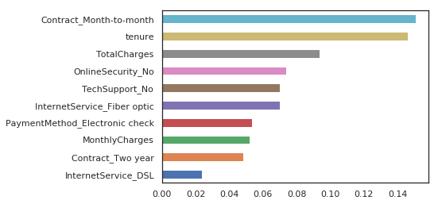

## Selected projects in Machine Learning

---

### Customer Churn Prediction

Analyzed 7043 records with 21 attributes to forecast customer churn for a Telecom Company, achieving a robust predictive model with 79% accuracy. Implemented sturdy *ML pipelines*, utilizing *DVC* for versioning data, and integrated *MLFlow* for efficient experiment tracking and model registry.

*Figure 1: Feature Importances for Logistic regression model.*

[View Application](https://appapppy-yq4zcdcq8wnggnqtk93bff.streamlit.app/)

[View code on GitHub](https://github.com/Govardhan211103/CustomerChurn)

---
### Walmart Sales Forecasting

"Wal-Mart Sales Forecasting" project focused on predicting sales trends. Efficiently processed 421k records, organized code for easy management, and developed a user-friendly interface with Flask API.

[View code on GitHub](https://github.com/Govardhan211103/SalesForecasting)

---

<h2>MLWithMe : Machine Learning from Foundations </h2>  
 
"MLWithMe" is a hands-on repository I created for learning machine learning from its foundations. Dive into ML, exploring core concepts from basics. Join me on this journey as we explore the world of machine learning together.
  
<a href = "https://github.com/Govardhan211103/MlWithMe">View repository on GitHub</a>

  

---

<h2>My Blogs</h2>

- <a href="https://govardhan211103.medium.com/what-why-machine-learning-b5816bc8c262">What & Why.. Machine Learning</a>
- <a href="https://govardhan211103.medium.com/correlation-among-features-and-between-feature-output-label-intuition-and-implementation-1fe66a1332a9"> Correlation among features in DataAnalysis</a>

